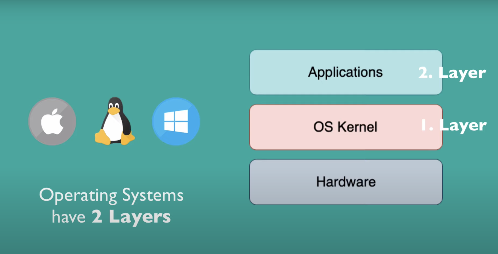
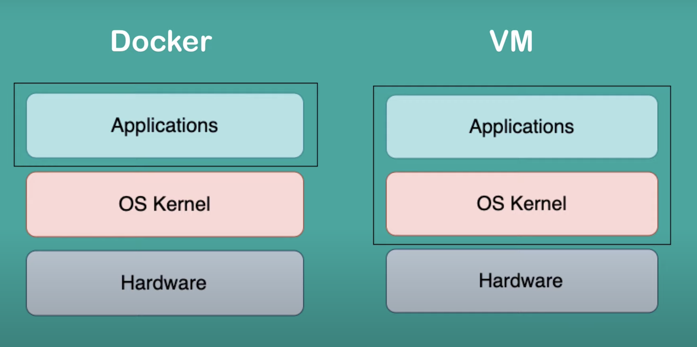
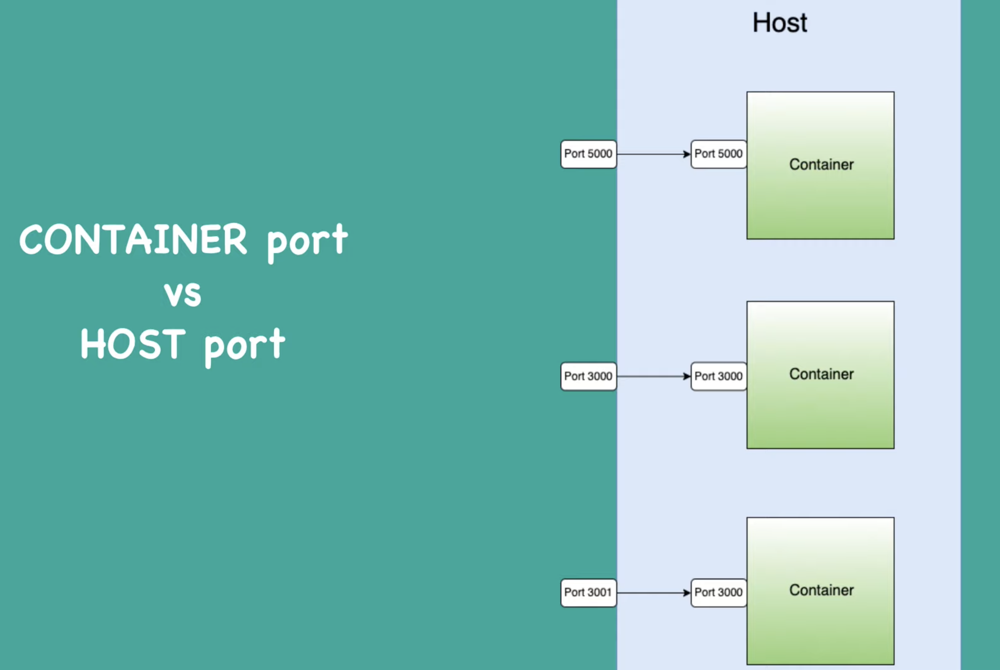
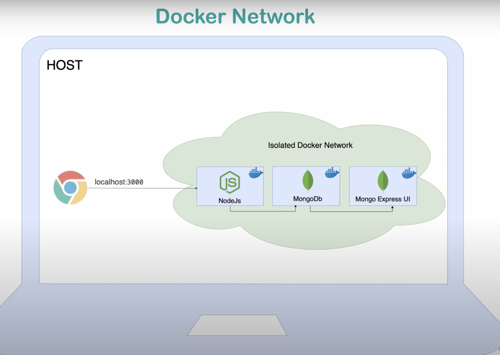

# Docker Notes:

## Docker Hub:
https://hub.docker.com/




## What is container
1. Layers of images
2. Mostly Linux Base image, because small in size (usually Alpine)
3. Application image on top

## Pulling the application image
1. From docker hub, search for the image
2. Pull the image:
 - docker pull postgres:<version> OR
 - docker run postgres:<version - 14.7>
```
Error: Database is uninitialized and superuser password is not specified.
       You must specify POSTGRES_PASSWORD to a non-empty value for the
       superuser. For example, "-e POSTGRES_PASSWORD=password" on "docker run".

       You may also use "POSTGRES_HOST_AUTH_METHOD=trust" to allow all
       connections without a password. This is *not* recommended.

       See PostgreSQL documentation about "trust":
       https://www.postgresql.org/docs/current/auth-trust.html
```
- docker run --name chandan-mysql-9.0.32 -e MYSQL_ROOT_PASSWORD=password -d mysql:8.0.32
- 
## Docker commands
1. `docker ps` - To get list of running containers
2. `docker pull <image-name-from-docker-hub>` - To pull latest image for the app
3. `docker images` - To get the list of local images
4. `docker run redis` - To run container of latest image of redis in foreground
5. `docker run redis -d` -> To run the image container in background/detached mode
6. `docker stop <container-id>` -> To stop the container, get container id using `docker ps`
7. `docker start <container-id>` -> To start the stopped container, use  `docker ps -a` to get the container id
8. `docker ps -a` -> To list all containers (running and stopped both)
9. `docker run redis:7.0.10` -> To run redis 7.0.10 version
10. `docker logs <container-id/container_name>` To check the logs for a container either container id or container name
11. `docker run -p6000:6379 -d redis` To bind host port 6000 to container port 6379 in detached mode
12. `docker run -d -p6001:6379 --name redis-6 redis:6` To run redis version 6 in detached mode with host port 6001 and name `redis-6`
13. `docker exec -it <container-id/container-name> /bin/bash` -> To start `interactive terminal` for a given container id OR name
14. `docker network ls` -> List docker networks
15. `docker network create <network-name>` -> To create isolated docker network
16. `docker run -p 27017:27017 -d --name <container-name-input> --net <existing-network-name> -e  MONGO_INITDB_ROOT_USERNAME=mongoadmin -e MONGO_INITDB_ROOT_PASSWORD=secret mongo` -> Starts a container with `cotainer-name-input` inside docker network `existing-network-name` on host port 2707 in detached mode with environment variables `MONGO_INITDB_ROOT_PASSWORD` and `MONGO_INITDB_ROOT_USERNAME`
17. `docker logs <container-id> -f` -> To stream the logs
18. `docker-compose -f mongo.yaml up -d` -> Starts all the containers inside the file(-f) mongo.yaml in detached mode
19. `docker-compose -f mongo.yaml down` -> Shut down all the containers inside the file mongo.yaml

## Docker container PORTS
```shell
chandan@~/Workspace/2023/docker (main) ± ➜ docker ps
CONTAINER ID   IMAGE          COMMAND                  CREATED         STATUS         PORTS      NAMES
322df54a488a   redis:7.0.10   "docker-entrypoint.s…"   5 seconds ago   Up 5 seconds   6379/tcp   reverent_kare

chandan@~/Workspace/2023/docker (main) ± ➜ docker run -d redis
4a13df3664307d76f2e8c081167b3c1ad3ca54a2c3d7ac445ba0db7fcd7c536b

chandan@~/Workspace/2023/docker (main) ± ➜ docker ps
CONTAINER ID   IMAGE          COMMAND                  CREATED          STATUS          PORTS      NAMES
4a13df366430   redis          "docker-entrypoint.s…"   4 seconds ago    Up 3 seconds    6379/tcp   compassionate_swartz
322df54a488a   redis:7.0.10   "docker-entrypoint.s…"   32 seconds ago   Up 31 seconds   6379/tcp   reverent_kare
```
Both the containers are running on 6379/tcp port.


We need to bind the container port to host (local machine) port. If we open two container port to
same host port, we'll get error. Container port can be same for two or more containers, but they 
must be bound to different host port.

To bind the port to specific host port, we need to provide host port while running/starting the container.
```shell
chandan@~/Workspace/2023/docker (main) ± ➜ docker stop 322df54a488a
322df54a488a

chandan@~/Workspace/2023/docker (main) ± ➜ docker stop 4a13df366430
4a13df366430

chandan@~/Workspace/2023/docker (main) ± ➜ docker run -p6000:6379 -d redis
72b2018cfe57145766c052cb1167134a87c3608b591d7c6d68ad51ca16e0db6b

chandan@~/Workspace/2023/docker (main) ± ➜ docker ps
CONTAINER ID   IMAGE     COMMAND                  CREATED         STATUS         PORTS                    NAMES
72b2018cfe57   redis     "docker-entrypoint.s…"   4 seconds ago   Up 3 seconds   0.0.0.0:6000->6379/tcp   ecstatic_chandrasekhar

chandan@~/Workspace/2023/docker (main) ± ➜ docker run -p3000:6379 -d redis:7.0.10
958e01ceb5424c81e41298a599c20be7e4f02e40564ebadb4416a466e5e0defc

chandan@~/Workspace/2023/docker (main) ± ➜ docker ps
CONTAINER ID   IMAGE          COMMAND                  CREATED          STATUS          PORTS                    NAMES
958e01ceb542   redis:7.0.10   "docker-entrypoint.s…"   3 seconds ago    Up 2 seconds    0.0.0.0:3000->6379/tcp   inspiring_hermann
72b2018cfe57   redis          "docker-entrypoint.s…"   35 seconds ago   Up 35 seconds   0.0.0.0:6000->6379/tcp   ecstatic_chandrasekhar

```
Now the host port 6000 is listening to latest redis container. Host port 3000 is listening to redis 7.0.10 docker container.

## Important concepts
1. Docker image and container : Docker image is actual package of the application, however, container is actually starting the application.
2. `docker run -d -p --name redis-latest redis:6` Docker run command have few options. It runs the image. However `docker start <container-id>` simply start the container based on the initial configuration given during `docker run`

## Docker debugging
1. `docker exec -it <container-id/container-name> /bin/bash` -> To start `interactive terminal` for a given container id OR name
2. `docker logs <container-id> -f` -> To stream the logs
```shell
chandan@~/Workspace/2023/docker (main) ± ➜ docker ps
CONTAINER ID   IMAGE          COMMAND                  CREATED          STATUS          PORTS                    NAMES
a68f4e2a458d   redis          "docker-entrypoint.s…"   4 seconds ago    Up 3 seconds    0.0.0.0:6000->6379/tcp   redis-latest
1b28812476ee   redis:6        "docker-entrypoint.s…"   2 minutes ago    Up 2 minutes    0.0.0.0:6001->6379/tcp   redis-6
958e01ceb542   redis:7.0.10   "docker-entrypoint.s…"   31 minutes ago   Up 31 minutes   0.0.0.0:3000->6379/tcp   inspiring_hermann

chandan@~/Workspace/2023/docker (main) ± ➜ docker exec -it a68f4e2a458d /bin/bash
root@a68f4e2a458d:/data# pwd
/data
root@a68f4e2a458d:/data# ls
root@a68f4e2a458d:/data# cd /
root@a68f4e2a458d:/# ls
bin  boot  data  dev  etc  home  lib  media  mnt  opt  proc  root  run  sbin  srv  sys  tmp  usr  var
root@a68f4e2a458d:/# 
root@a68f4e2a458d:/# env
HOSTNAME=a68f4e2a458d
REDIS_DOWNLOAD_SHA=1dee4c6487341cae7bd6432ff7590906522215a061fdef87c7d040a0cb600131
PWD=/
HOME=/root
REDIS_VERSION=7.0.10
GOSU_VERSION=1.16
TERM=xterm
REDIS_DOWNLOAD_URL=http://download.redis.io/releases/redis-7.0.10.tar.gz
SHLVL=1
PATH=/usr/local/sbin:/usr/local/bin:/usr/sbin:/usr/bin:/sbin:/bin
_=/usr/bin/env
OLDPWD=/data
root@a68f4e2a458d:/# exit
exit
chandan@~/Workspace/2023/docker (main) ± ➜ docker ps
CONTAINER ID   IMAGE           COMMAND                  CREATED          STATUS          PORTS                      NAMES
42faee149262   mongo-express   "tini -- /docker-ent…"   10 minutes ago   Up 10 minutes   0.0.0.0:8081->8081/tcp     mongo-express
64e7ecf3386f   mongo           "docker-entrypoint.s…"   22 minutes ago   Up 22 minutes   0.0.0.0:27017->27017/tcp   mongodb

chandan@~/Workspace/2023/docker (main) ± ➜ docker logs 42faee149262 -f
...
chandan@~/Workspace/2023/docker (main) ± ➜ docker logs 42faee149262 | tail
(node:7) [MONGODB DRIVER] Warning: Current Server Discovery and Monitoring engine is deprecated, and will be removed in a future version. To use the new Server Discover and Monitoring engine, pass option { useUnifiedTopology: true } to the MongoClient constructor.
Server is open to allow connections from anyone (0.0.0.0)
basicAuth credentials are "admin:pass", it is recommended you change this in your config.js!
(node:7) DeprecationWarning: collection.count is deprecated, and will be removed in a future version. Use Collection.countDocuments or Collection.estimatedDocumentCount instead
GET /public/css/bootstrap.min.css 304 0.799 ms - -
GET /public/css/bootstrap-theme.min.css 304 2.904 ms - -
GET /public/css/style.css 304 1.798 ms - -
GET /public/css/codemirror.css 304 1.504 ms - -
GET /public/css/theme/rubyblue.css 304 1.475 ms - -
GET /public/codemirror-cd38c6e59d64ef16b149.min.js 304 1.267 ms - -
GET /public/vendor-d1b820f8a9cf3d5a8c6a.min.js 304 0.926 ms - -
GET /public/collection-fe2ea09c2dc014cda478.min.js 304 0.616 ms - -
GET /public/img/mongo-express-logo.png 304 0.578 ms - -
GET /public/img/gears.gif 304 0.599 ms - -

```
Since most of the container images are based on light-weight linux distribution, so we may not have all shell commands
available in this `interactive terminal` mode. Example below:

```shell
chandan@~/Workspace/2023/docker (main) ± ➜ docker exec -it a68f4e2a458d /bin/bash
root@a68f4e2a458d:/data# ls  
root@a68f4e2a458d:/data# cd /
root@a68f4e2a458d:/# ls
bin  boot  data  dev  etc  home  lib  media  mnt  opt  proc  root  run  sbin  srv  sys  tmp  usr  var
root@a68f4e2a458d:/# curl
bash: curl: command not found

```

## Docker network
`docker network ls` -> Lists all docker network

Inside isolated docker network, one container can talk to other container with just container name.
Anything outside docker network, need to connect via a PORT number. 



`docker network create mongo-network` -> To create isolated docker network
`docker run -p 27017:27017 -d --name <container-name-input> --net <existing-network-name> -e  MONGO_INITDB_ROOT_USERNAME=mongoadmin -e MONGO_INITDB_ROOT_PASSWORD=secret mongo` -> Starts a container with `cotainer-name-input` inside docker network `existing-network-name` on host port 2707 in detached mode with environment variables `MONGO_INITDB_ROOT_PASSWORD` and `MONGO_INITDB_ROOT_USERNAME`
```shell
chandan@~/Workspace/2023/docker (main) ± ➜ docker network ls
NETWORK ID     NAME      DRIVER    SCOPE
515e41cca0f3   bridge    bridge    local
2553cd094a51   host      host      local
10220620e69d   none      null      local

chandan@~/Workspace/2023/docker (main) ± ➜ docker network create mongo-network
6107ddaf1391158eef4a2784495c5bd2fd856cc3653d749fe3611a135662a658

chandan@~/Workspace/2023/docker (main) ± ➜ docker network ls
NETWORK ID     NAME            DRIVER    SCOPE
515e41cca0f3   bridge          bridge    local
2553cd094a51   host            host      local
6107ddaf1391   mongo-network   bridge    local
10220620e69d   none            null      local
chandan@~/Workspace/2023/docker (main) ± ➜ docker run -p 27017:27017  \       
> -d -e MONGO_INITDB_ROOT_USERNAME=mongoadmin \
> -e MONGO_INITDB_ROOT_PASSWORD=secret \
> --name mongodb --net mongo-network \
> mongo
64e7ecf3386f20e2479b84f8b646d1e3ebd50eacd4eacb717beb86a668f4a13a
chandan@~/Workspace/2023/docker (main) ± ➜ docker logs 64e7ecf3386f20e2479b84f8b646d1e3ebd50eacd4eacb717beb86a668f4a13a
chandan@~/Workspace/2023/docker (main) ± ➜ docker run -d \
>    --network mongo-network \
>    --name mongo-express \
>    -p 8081:8081 \
>    -e ME_CONFIG_MONGODB_ADMINUSERNAME="mongoadmin" \
>    -e ME_CONFIG_MONGODB_ADMINPASSWORD="secret" \
>    -e ME_CONFIG_MONGODB_SERVER="mongodb" \
>    mongo-express
42faee14926233160f7428e5bce3236140dc058e9af1f4b92f0f3dff227a751e

```

## Docker compose
Dockerfile - blueprint for building 
Docker compose creates a default common network for all the containers configured inside the docker compose file.

1. `docker-compose -f mongo.yaml up` -> Starts all the containers inside the file mongo.yaml
2. `docker-compose -f mongo.yaml down` -> Shut down all the containers inside the file mongo.yaml

`mongo.yaml`
```yaml 
version: '3'
services:
  <container-name>:
    image: <app-image-name>
    ports:
      - 27017:27017
    environment:
      - MONGO_INITDB_ROOT_USERNAME=mongoadmin
      - MONGO_INITDB_ROOT_PASSWORD=secret
  
```

## Docker playground
https://labs.play-with-docker.com/

### [Click here to view Docker in parctice](README-app.md)


## Docker Learning Resources
1. Learning Docker - https://youtu.be/3c-iBn73dDE
2. Series - https://youtu.be/GeqaTjKMWeY

